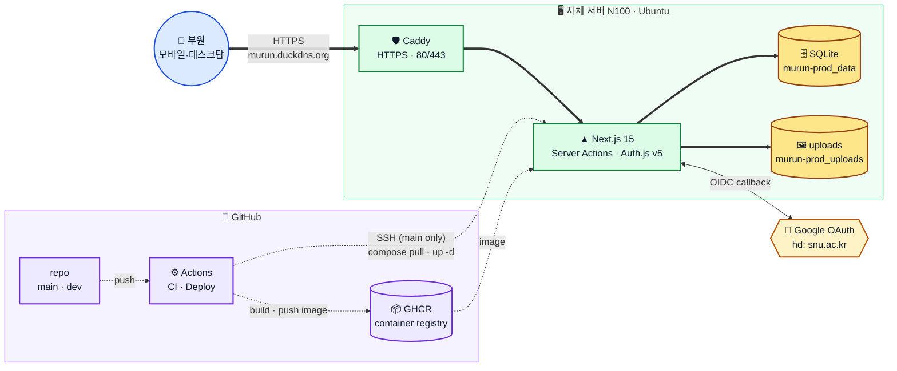
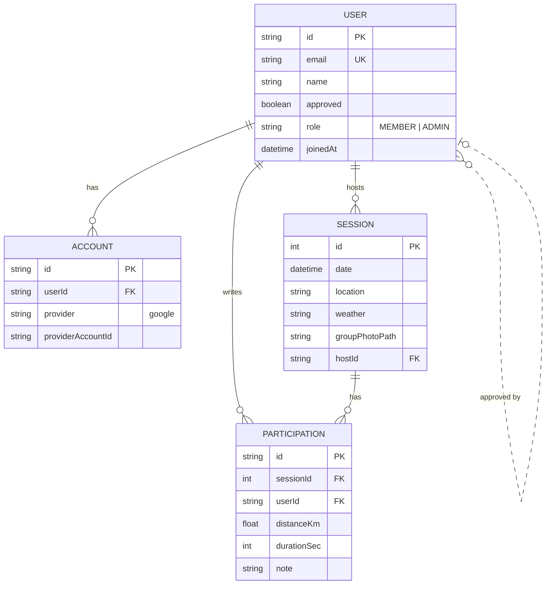
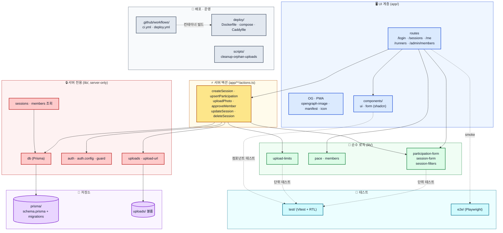

# Architecture Overview

> 뮤런의 시스템 구성·코드 레이아웃·요청 흐름을 한 페이지에 담은 발표용 정리.
> 세부 결정은 [`02-Tech-Stack`](02-Tech-Stack), 화면/권한 매트릭스는 [`03-Screen-Flow`](03-Screen-Flow) 참조.

## 1. 시스템 아키텍처



읽는 법:

- **굵은 실선** = 런타임 사용자 트래픽
- **점선** = GitHub Actions 빌드/배포 파이프라인
- N100 한 호스트 안에 Caddy / Next.js / SQLite / uploads 가 같이 산다 (외부 DB 없음).
- 인증만 외부(Google OAuth)에 위탁, 그 외 사용자 데이터는 모두 자체 볼륨.
- `dev` push는 GHCR `staging-<sha>` 이미지 빌드/푸시까지만 가고 N100엔 들어가지 않는다. `main` push만 prod 배포.

## 2. 데이터 모델 (Prisma)



핵심:

- `Session.id` 는 `Int autoincrement` — 내부 동아리용이라 enumeration 차단보다 단톡방 공유 가독성 우선.
- `(sessionId, userId)` unique — 본인은 한 세션에 행 1개.
- `User.approved` 와 `User.role` 분리 — 가입 정책(화이트리스트)과 운영 권한은 다른 축.
- 페이스(`pace`)는 저장 안 함 — `distanceKm + durationSec` 둘 다 있을 때 derived. (`lib/pace.ts`)
- 사진은 파일 경로(`groupPhotoPath`)만 저장 — 원본은 `uploads/` 볼륨.

스키마 원본: [`prisma/schema.prisma`](https://github.com/boostcampwm-snu-2026-1/murun-peterabcd/blob/main/prisma/schema.prisma).
권한 매트릭스: [`03-Screen-Flow §5`](03-Screen-Flow#5-권한-매트릭스).

## 3. 모듈 레이어



읽는 법:

- **위에서 아래로** 의존 방향. 위 계층은 아래 계층을 부르고, 그 반대는 없다.
- `lib/` 는 의도적으로 두 덩어리. **순수 로직**은 단위 테스트가 직접 붙고, **서버 전용**은 `import "server-only"` 가드로 클라이언트 번들에 새지 않게 한다.
- 서버 액션(`app/**/actions.ts`)이 도메인 진입점. 라우트는 항상 액션을 거쳐 DB에 닿는다.
- 테스트는 “가장 깨지기 쉬운 경계”에 우선 박는다 — 폼 파싱, 필터 파싱, 업로드 제한, 핵심 사용자 흐름 smoke.

## 4. 폴더 구조 (실제, Week 3 종료 시점)

```
murun-peterabcd/
├─ app/
│  ├─ layout.tsx · page.tsx · globals.css
│  ├─ login/page.tsx                      # Auth.js v5 + 에러 한국어
│  ├─ pending/page.tsx                    # 가입 승인 대기
│  ├─ admin/members/page.tsx              # 승인/거절 (requireAdmin)
│  ├─ sessions/
│  │  ├─ page.tsx                         # 아카이브 + 필터
│  │  ├─ _components/{FilterBar,SessionCard,EmptyState}.tsx
│  │  ├─ new/{page.tsx,actions.ts,_components/}
│  │  └─ [id]/
│  │     ├─ page.tsx                      # 세션 상세
│  │     ├─ opengraph-image.tsx           # 카톡 OG (sharp)
│  │     ├─ actions.ts                    # upsertParticipation
│  │     ├─ photo-actions.ts              # 사진 업로드/교체/삭제
│  │     ├─ edit/{page.tsx,actions.ts,_components/EditSessionForm.tsx}
│  │     └─ _components/{PhotoSection,PhotoReplaceButton,MyParticipationForm,...}.tsx
│  ├─ me/page.tsx                         # 내 통계
│  ├─ runners/[id]/page.tsx               # 멤버 통계
│  ├─ api/
│  │  ├─ auth/[...nextauth]/route.ts      # Auth.js handler
│  │  ├─ health/route.ts                  # /api/health
│  │  └─ uploads/[...path]/route.ts       # 인증된 정적 파일 서빙
│  ├─ opengraph-image.tsx                 # 홈 OG
│  └─ icon.tsx · apple-icon.tsx · icons/[size]/route.tsx · manifest.ts  # PWA
├─ components/
│  ├─ ui/{button,input,label,textarea}.tsx          # shadcn 복사본
│  └─ form/{SubmitButton,ErrorAlert}.tsx            # 공용 폼 조각
├─ lib/
│  ├─ db.ts                               # PrismaClient (싱글톤)
│  ├─ auth.ts · auth.config.ts            # Auth.js v5 (Google + adapter)
│  ├─ guard.ts                            # requireUser · requireAdmin · requireHostOrAdmin · requireE2eUser
│  ├─ sessions.ts                         # 아카이브 조회 + raw SQL count 필터
│  ├─ members.ts                          # 누적 거리 · 평균 페이스 · 추이
│  ├─ pace.ts                             # 페이스 순수 계산
│  ├─ participation-form.ts               # 본인 행 파싱 (테스트 대상)
│  ├─ session-form.ts                     # 세션 폼 파싱
│  ├─ session-filters.ts                  # URL 쿼리 ↔ 필터 객체
│  ├─ uploads.ts                          # 디스크 IO (server-only)
│  ├─ upload-url.ts                       # 공개 URL helper
│  ├─ upload-limits.ts                    # 15MB / MIME / checkUploadFile (공유)
│  ├─ og-font.ts                          # OG 폰트 로딩
│  └─ utils.ts
├─ prisma/
│  ├─ schema.prisma                       # User · Account · Session · Participation
│  └─ migrations/
├─ deploy/
│  ├─ Dockerfile                          # multi-stage standalone
│  ├─ docker-compose.yml                  # caddy + app
│  ├─ Caddyfile                           # 자동 HTTPS
│  ├─ entrypoint.sh                       # migrate deploy + node server.js
│  ├─ .env.example · README.md
├─ scripts/
│  └─ cleanup-orphan-uploads.mjs          # DB ↔ 파일 비교 후 삭제
├─ .github/
│  ├─ workflows/{ci.yml,deploy.yml}
│  ├─ ISSUE_TEMPLATE/ · PULL_REQUEST_TEMPLATE.md
├─ test/                                  # Vitest 단위/컴포넌트
├─ e2e/                                   # Playwright smoke
├─ docs/wiki/                             # 이 문서 포함
├─ .gjc/{specs,skills}/                   # Agent 컨텍스트
├─ middleware.ts                          # OG bypass · 로그인 redirect · E2E bypass
├─ next.config.ts                         # serverActions.bodySizeLimit: "20mb"
└─ vitest.config.ts · playwright.config.ts · tailwind.config.ts · ...
```

## 5. 핵심 요청 흐름 한 줄 정리

- **참여 기록 저장**
  브라우저 → Caddy → Next.js → `upsertParticipation` (Server Action) → `requireUser()` → `parseParticipationForm()` → Prisma → `revalidatePath` → 상세 페이지에 본인 행 표시.
- **사진 업로드**
  브라우저 preflight(`checkUploadFile`) → Server Action → 서버 재검증(`upload-limits`) → `storeUploadedFile()` → `Session.groupPhotoPath` 갱신 → 다음 요청 때 `opengraph-image` 가 해당 경로 합성.
- **관리자 승인**
  `/admin/members` → `requireAdmin()` → Prisma `User.update({ approved, approvedById, approvedAt, role })`.
- **OAuth 로그인**
  `/login` → Auth.js v5 → Google OIDC (`hd: snu.ac.kr`) → 콜백 → 화이트리스트 확인 → 미승인이면 `/pending`, 오류면 `/login?error=...` 한국어 안내.
- **세션 수정/삭제**
  `/sessions/[id]/edit` → `requireHostOrAdmin()` → `updateSession` / `deleteSession` (cascade) + `deleteUploadedFile()`.

## 6. 배포 흐름

- `main` push → CI(typecheck · lint · test · build) → GHCR `prod-<sha>` 푸시 → N100 SSH → `docker compose pull && up -d` → post-deploy smoke(`/api/health` 200, `/login?error=Configuration` 한국어).
- `dev` push → CI + GHCR `staging-<sha>` 푸시까지만, N100 미배포 (`deploy.yml` 의 분기).
- 수동: `workflow_dispatch` 는 `prod` 만 허용.

## 7. 환경별 SSOT (Single Source of Truth)

| 영역 | 위치 |
|------|------|
| 데이터 모델 | `prisma/schema.prisma` |
| 권한 매트릭스 | [`03-Screen-Flow §5`](03-Screen-Flow#5-권한-매트릭스) |
| 업로드 제약 (15MB · MIME) | `lib/upload-limits.ts` |
| 화면 흐름 / 페이지 목록 | [`03-Screen-Flow`](03-Screen-Flow) |
| 기술 결정 근거 | [`02-Tech-Stack`](02-Tech-Stack) |
| Agent 작업 절차 | `.gjc/skills/murun-feature/SKILL.md` |
| 배포 정책 | `deploy/README.md` · `.github/workflows/deploy.yml` |
| 보류 결정과 후속 TODO | [`09-Backlog-and-Decisions`](09-Backlog-and-Decisions) |
